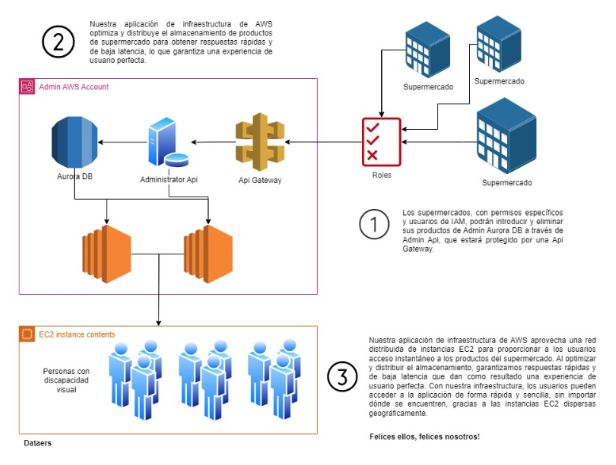

# Hackathon For Good: La Región de AWS en España al Servicio de la Sociedad

## Descripción del Proyecto

El reto que se ha escogido es el de la ONCE.

El proyecto tiene como finalidad facilitar la acción de ir al Supermercado a personas con discapacidades visuales. Nuestra solución permite a esas personas ser capaces de desplazarse por el supermercado y de buscar los productos desados de manera fácil y sencilla.

El caso de uso de nuestra aplicación/sistema són los Supermercados, pues ellos són los que tienen la capacidad de hacer que la implementación sea posible.
Ellos son quienes facilitaían los recursos e infraestructura para que las pesonas con discapacidad puedan realizar la compra.

El funcionamiento del sistema es el siguiente:
* Mediante un dispositivo (no es necesario que sea un móvil) se escanearán diferentes indicadores que podemos encontrar en el supermercado.
* Desde el dispositivo, se porá seleccionar si lo que se desea seleccionar es un cartel de Sección (p.j. un código QR que tenga codificada la palabra LÁCTEO) o si por el contrario se quiere escanear un producto.
* En caso de que se escaneen secciones, el descifrado del código es directo. Si se escanean codigos de barras, la aplicación hará una llamada a el Backend, el cual buscará la información de dicho producto.

También se permitirá a los Supermercados tener acceso a la información, de tal manera que se podrá tener de manera actualizada información de los precios, etc.

## Diagrama de Arquitectura

## Descripción Técnica

Para abordar el desafío propuesto por el reto de la Once, nuestro equipo ha creado una solución innovadora que busca hacer que la experiencia de compra en supermercados sea más accesible para las personas con discapacidad visual. Para ello, hemos ideado un dispositivo que, conectado a unos auriculares, guía al usuario a través de instrucciones auditivas que le indican la ubicación de los productos y secciones en el supermercado, todo ello a partir del escaneo de códigos de barras, QR, entre otros.

Para hacer realidad esta idea, hemos diseñado una arquitectura de infraestructura en AWS que combina diferentes componentes de red, como internet gateways, security groups, load balancers, y varias instancias EC2 del tipo Graviton, distribuidas en diferentes regiones y zonas de disponibilidad. Asimismo, contamos con varias instancias y clusters de la base de datos Aurora para garantizar la rápida disponibilidad y baja latencia de los datos del supermercado.

En lo que respecta al supermercado, nuestra aplicación cuenta con una API Gateway que permite conectarnos a una API para actualizar las bases de datos de manera eficiente y segura. Tanto los supermercados como los administradores de la aplicación tendrán roles específicos para administrar las bases de datos, usuarios y las instancias EC2, lo que garantiza la seguridad y privacidad de la información. En resumen, nuestra solución busca hacer que las compras sean más fáciles y accesibles para todos, al tiempo que promueve la sostenibilidad y la eficiencia en la gestión de la información.

## Documentación Completa en formato PDF

## Demo Vídeo

## Team Members

Sergi Garriga Mas (segama4@gmail.com)
Raül Dalgamonni Alonso (rauldalgamonnialonso@gmail.com)
 
